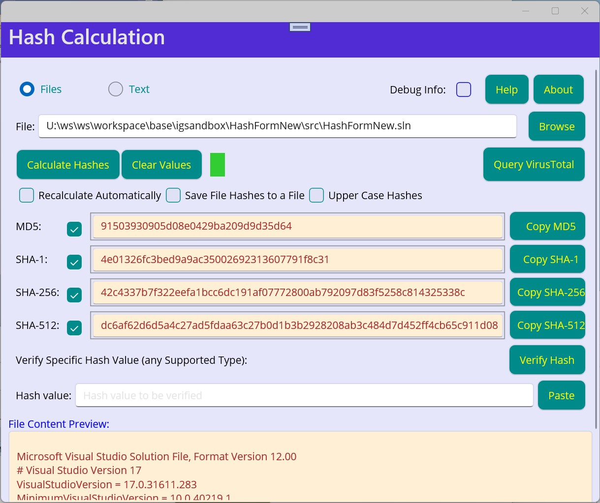

# About the new HashForm

This is reimplementation of IGLib's HashForm application, a simple and user friendly app for computation of various checksums or cryptographic hash functions of files an text. The original software is available here:
* *https://www.softpedia.com/get/Others/Miscellaneous/HashForm.shtml*
* *http://www2.arnes.si/~ljc3m2/igor/software/IGLibShellApp/HashForm.html#hashform*

Currently implemented features include:
* File hashing
  * Browsing to file path (drag & drob not working due to an issue with UI framework)
* Hashing text inserted bt user
* Calculation of MD5, SHA-1, SHA-256, ans SHA-512 hashes
* Hash verification
* Automatic recalculation when settings are changed
* Possibility to query VirusTotal for information about the files
* Possibility yo save file hashes to a file
* Concurrent calculation of different hashes, with possibility of cancellation
* Indicator light to indicate current status

Other functionality may be added in the future.

I have created this app to test the .NET MAUI, a new framework for cross-platform UI development. The application was tested on Android. Linux application will depend on the availability of the .NET MAUI implementation on that platform (the original application referenced above run on Linux with Mono framework installed, without changing the binaries (bytecode)).

The .NET MAUI is was stil lin pre-release stage when creating this app. There are still  a lot of bugs and inconsistent behavior, which will probably take some time to improve. This prevented effective implementation of some features, especially related to application layout. The drag and drop functuinality (e.g. possibility to drag a file into the application from a file manager, instead of browsing or inserting file path manually) could also not be implemented. On windows, there are also issues with generating unpacked applicaiton, which could be run directly bu double clicking the executable. I may come back in some time and implement some additional features when the framework is more production ready.

Copyright (c) Igor Grešovnik
This repository is part of the Investigative Generic Library (IGLib). See license for terms of use.
